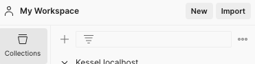
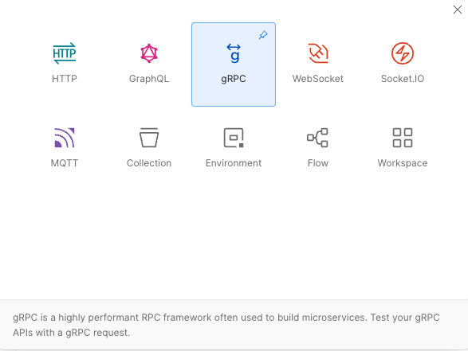
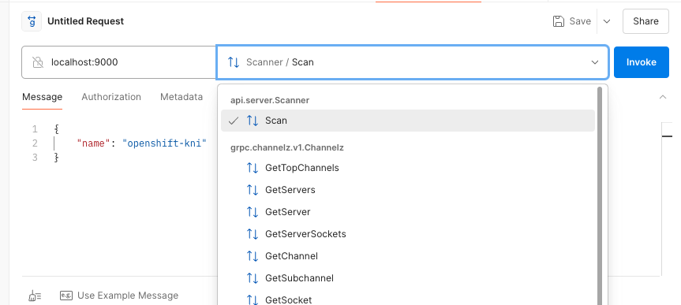

# security-scanner

A gRPC server for security scanning using [OPA](https://www.openpolicyagent.org/)

## Requirements
Set Github token
```bash
export GITHUB_TOKEN=<your_token>
```

## Running the server
Follow the [server README](server/README.md)

## Connecting with Postman client
1. Launch Postman and navigating to `File > New` or click on `New` button as shown:

2. Select “gRPC” option from the as shown:

3. Set the gRPC endpoints url for local development use `localhost:9000`. Next click on `select a method` input box as shown and Select the Import a .proto file from the options.

Choose the `scan` method and use the following message
```json
{
    "name": "org_name"
}
```
You will get the result as a json string


## TODO
- Dynamic OPA policy
- [Cobra client](https://cobra.dev/)